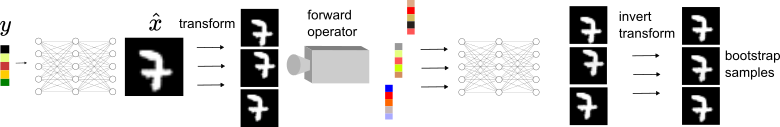

# Equivariant Bootstrapping for Uncertainty Quantification in Imaging Inverse Problems

Code of the paper
["Learning to reconstruct signals from binary measurements alone"](https://arxiv.org/abs/2303.08691) by [Julian Tachella](https://tachella.github.io/)
and [Marcelo Pereyra](https://www.macs.hw.ac.uk/~mp71/about.html).

We use the [deepinv library](https://deepinv.github.io/deepinv/)
for most of the code.



# Getting Started
1. Clone the repository
2. Install the latest version of deepinv
```
pip install git+https://github.com/deepinv/deepinv.git#egg=deepinv
```
3. Download the datasets and model checkpoints from the HuggingFace repository 
[jtachella/equivariant_bootstrap](https://huggingface.co/jtachella/equivariant_bootstrap) by running
```
git lfs clone https://huggingface.co/jtachella/equivariant_bootstrap
```
and  place them in the `datasets` folder (you might need to run `git lfs install` first).
5. Run the `main.py` file to run the proposed equivariant bootstrapping technique for uncertainty quantification, and
the other competing methods (ULA, diffPIR and DDRM).


# Citation
```
@article{tachella2023bootstrap,
  title={Equivariant Bootstrapping for Uncertainty Quantification in Imaging Inverse Problems},
  author={Tachella, Julian and Pereyra, Marcelo},
  journal={arXiv preprint arXiv:2310.11838},
  year={2023}
}
```