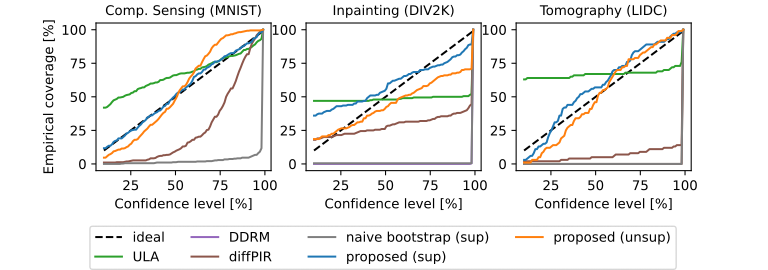

# Equivariant Bootstrapping for Uncertainty Quantification in Imaging Inverse Problems

Code of the paper
["Learning to reconstruct signals from binary measurements alone"](https://arxiv.org/abs/2303.08691) by [Julian Tachella](https://tachella.github.io/)
and [Marcelo Pereyra](https://www.macs.hw.ac.uk/~mp71/about.html).

We use the [deepinv library](https://deepinv.github.io/deepinv/)
for most of the code.


# Method Description

The equivariant bootstrap method is a simple resampling procedure which produces well-calibrated uncertainty intervals 
for any reconstruction network (i.e., trained in a supervised or self-supervised manner). The method outperforms other 
SOTA diffusion-based methods in terms of coverage, speed and test PSNR.

Assuming that the forward process associated with the inverse problem is described as 

$$
y = \mathcal{P}(Ax)
$$

where $A$ is a linear operator and $\mathcal{P}$ is a stochastic process modelling the noise 
(e.g., the addition of Gaussian or Poisson noise)

For a reconstruction network $\hat{x}(y)$ with input measurement $y$, the method generates new samples as

$$
x^{(i)} = T_g^{-1}\hat{y}\left(P(AT_g\hat{x}(y + \epsilon^{(i)}))\right)
$$

where $T_g$ is a group transformation (e.g., rotation, translation, etc.). These samples are then used to compute 
confidence intervals of the MSE and/or pixel-wise variants (or any other statistic of interest).

# Getting Started
1. Clone the repository
2. Install the latest version of deepinv if you don't have it already
```
pip install git+https://github.com/deepinv/deepinv.git#egg=deepinv
```
3. Install huggingface_hub if you don't have it already
```
pip install huggingface_hub
```
4. Run the `main.py` file to run the proposed equivariant bootstrapping technique for uncertainty quantification, and
the other competing methods (ULA, diffPIR and DDRM). The script downloads automatically the datasets and pretrained models from the [deepinv library](https://deepinv.github.io/deepinv/)
and the HuggingFace repo [jtachella/equivariant_bootstrap](https://huggingface.co/jtachella/equivariant_bootstrap).

# Results
The following figure shows the coverage of the proposed method (Equivariant Bootstrap) and the other competing methods
(see the paper for more details). The proposed method significantly outperforms the other methods in terms of coverage. 



The following table shows the average test PSNR of the proposed method (Equivariant Bootstrap) and the other competing methods:


# Citation
```
@article{tachella2023bootstrap,
  title={Equivariant Bootstrapping for Uncertainty Quantification in Imaging Inverse Problems},
  author={Tachella, Julian and Pereyra, Marcelo},
  journal={arXiv preprint arXiv:2310.11838},
  year={2023}
}
```